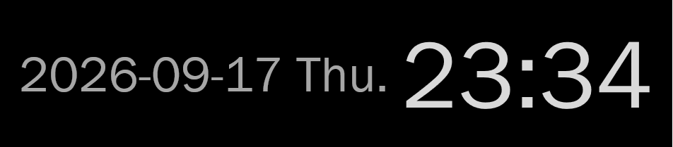
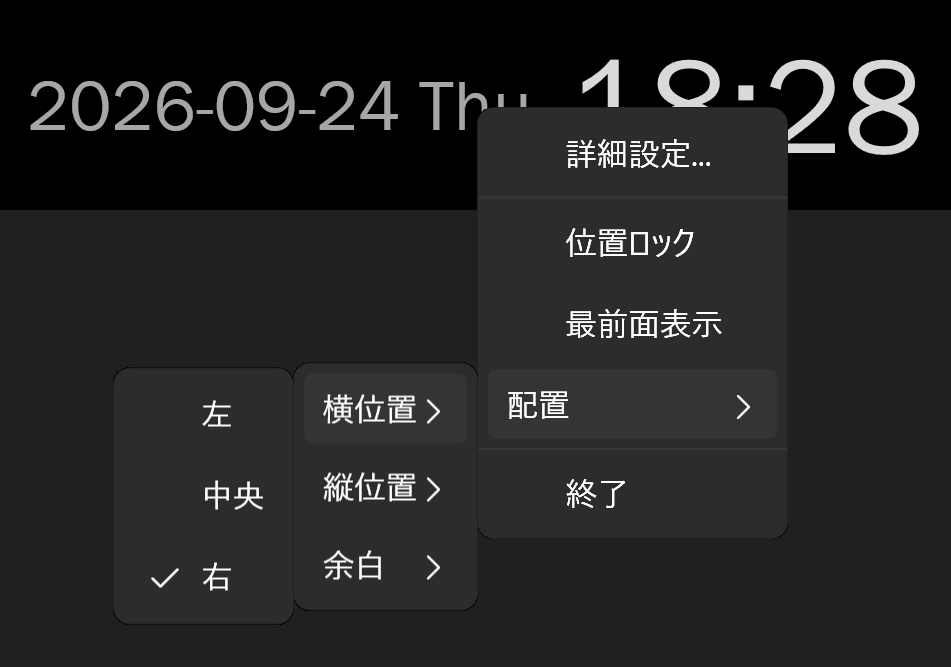
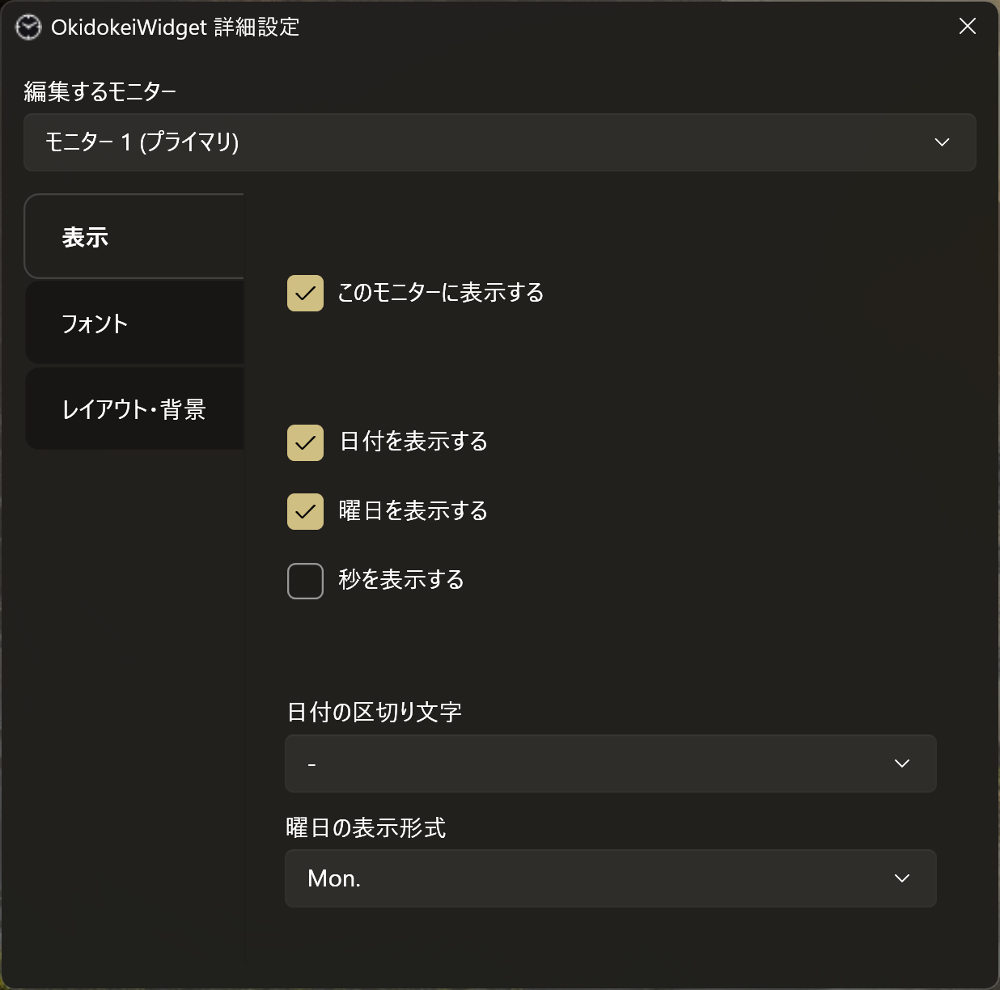

# OkidokeiWidget

[GitHub Spec Kit](https://github.com/github/spec-kit) と [Claude Code](https://claude.com/claude-code) で作った、
Windows 11 向けの常駐型デスクトップ時計ウィジェットです。

このリポジトリは、アプリの公開と同時に、**Spec Kit を使った AI 駆動開発の実例**として、
仕様・実装計画・タスク・バグ修正の記録をそのまま残して公開しています。
要件定義からリリース後の追加要望・バグ修正まで、Spec Kit の成果物がどう積み上がっていったかをファイルから追えます。

| デスクトップ上のウィジェット | 右クリックメニュー | 詳細設定 |
|---|---|---|
|  |  |  |

## 開発の流れ

1. **要件定義**: 作りたいものを [Web の Claude](https://claude.ai/) と相談して、要件定義書にまとめました
2. **原則を決める** (`/speckit-constitution`): 「個人用ツールなので作り込まない」「設定は JSON」
   「誤操作で位置が変わらない」など、判断に迷ったときに立ち返る原則を決めました
3. **仕様を書く** (`/speckit-specify` → `/speckit-clarify`): 要件定義書から仕様を作り、
   あいまいな点を Claude からの質問に答えて詰めました
4. **計画とタスク** (`/speckit-plan` → `/speckit-tasks`): 技術的な設計と、実装タスクへの分解を行いました
5. **実装前の確認** (`/speckit-checklist` → `/speckit-analyze`): 仕様・計画・タスクの抜けや矛盾を確かめました
6. **実装** (`/speckit-implement`): ユーザーストーリー (P1〜P3) ごとに実装し、人間が実機で確認しました
7. **リリース後**: 追加要望とバグ修正を、同じ仕組みの上で続けています
   - 追加要望は `/speckit-specify` からやり直し、仕様の変更として記録しました
   - バグ修正は Spec Kit の bug 拡張で、調査 (assess) → 修正 (fix) → 検証 (test) の順に進めました

> [!TIP]
> 作者は C# をほとんど書いたことがなく、コードはほぼ読まずに Claude Code に任せています。  
> 人間が受け持ったのは、仕様の判断・PR のレビュー (主に仕様や記録の確認)・実機での確認です。  
> コード・テスト・各成果物の作成は Claude Code が行いました。
>
> 開発の経緯と、コードを読まない人間が何をどう確かめたかは、note の記事にまとめています。
>  - [コードは書けなくても「確かめる人」にはなれる 〜 AI とデスクトップ時計を作った話](https://note.com/probono_a/n/n559623ccc05f)

## 読みどころ

どのファイルも、開発中に Claude Code が作り、人間が確認したものをそのまま置いています。

| ファイル | 何が分かるか |
|---|---|
| [docs/requirements.md](docs/requirements.md) | 最初のインプットにした要件定義書 |
| [.specify/memory/constitution.md](.specify/memory/constitution.md) | プロジェクトの原則。開発中に起きた失敗から足したルールもあります (Development Workflow の 7 など) |
| [specs/001-clock-widget/spec.md](specs/001-clock-widget/spec.md) | 機能仕様。冒頭の Clarifications に、質問と回答・実機確認からの追加要望が日付つきで積み上がっています |
| [specs/001-clock-widget/plan.md](specs/001-clock-widget/plan.md)・[research.md](specs/001-clock-widget/research.md) | 技術的な設計と、その根拠にした調査 |
| [specs/001-clock-widget/tasks.md](specs/001-clock-widget/tasks.md) | 実装タスク。Phase 7 までが最初の実装で、Phase 8 以降はリリース後の追加要望・バグ修正です |
| [specs/001-clock-widget/checklists/](specs/001-clock-widget/checklists/) | 実装前に仕様の品質を確かめたチェックリスト |
| [.specify/bugs/](.specify/bugs/) | バグ修正ごとの調査・修正・検証の記録 |
| [CLAUDE.md](CLAUDE.md) | Claude Code への指示 (進め方・ブランチ運用・文章の書き方) |

> [!IMPORTANT]
> 文中の issue 番号は、開発に使っている非公開のリポジトリのものです。このリポジトリからは参照できません。

## できること

- 時刻・日付・曜日の常時表示
- フォント種類・サイズ・文字色のカスタマイズ
- 背景透過度の調整
- ドラッグでの自由配置、位置ロックによる誤操作防止
  - ドラッグで動かせるのは、表示中のモニタの作業領域 (タスクバーを除いた領域) 内に限ります
- 画面の隅や中央に寄せる配置 (横位置・縦位置・画面端からの余白を右クリックメニューから選択)
  - フォントサイズや表示の拡大率が変わっても、寄せた位置を保ちます
  - 自由配置のときも、余白を選ぶと近くの画面端から離せます
- 常に最前面に表示するかどうかの切り替え
- モニタごとの表示/非表示・表示位置・見た目・位置ロック・最前面表示の個別管理 (モニタの接続/切断にも追随)
  - 例: メインのモニタでは大きな文字で日付も表示し、サブのモニタでは時刻だけを小さく表示する
  - 初めてつないだモニタには、時計を表示しません (会議室のプロジェクターなどに、つなぐたびに出ないようにするため)
- 右クリックメニューでのクイック切替 + 詳細設定ウィンドウ
- タスクトレイ常駐 + Windows 起動時の自動起動
  - タスクトレイの右クリックメニューから、詳細設定を開く・自動起動の ON/OFF・終了ができます
- 設定は JSON ファイルで保存 (レジストリは使用しません)

Microsoft Store にある既存のウィジェットで満足できるものがなかったため、個人用に作りました。

## 使い方

必要環境: Windows 11 / .NET 10 SDK

### .NET 10 SDK のインストール

PowerShell で次を実行します (winget は Windows 11 に標準で入っています)。

```powershell
winget install Microsoft.DotNet.SDK.10
```

winget を使わない場合は、[.NET 10 のダウンロードページ](https://dotnet.microsoft.com/download/dotnet/10.0) から
Windows 用の SDK (x64) のインストーラーを入手して実行します。  
Windows 版の SDK には WPF のビルドに必要なものが含まれているため、追加のワークロードは不要です。

インストール後に PowerShell を開き直し、次のコマンドで `10.0.xxx` が表示されれば準備完了です。

```powershell
dotnet --list-sdks
```

### ビルドと起動

リポジトリのフォルダで次を実行してビルドします。

```powershell
dotnet build .\src\OkidokeiWidget.App\OkidokeiWidget.App.csproj -c Release
```

生成された `src/OkidokeiWidget.App/bin/Release/net10.0-windows/OkidokeiWidget.App.exe`
を起動します。  
初めて起動したときは、プライマリモニタにだけ時計が表示されます。

- ウィジェットを右クリック →「詳細設定」から、そのモニタの見た目と表示/非表示を設定できます
  - 画面の上の「編集するモニター」で、設定するモニタを切り替えます
  - 時計が表示されていないモニタに表示するには、そのモニタを選んで「このモニターに表示する」をオンにします
- 位置ロック・最前面表示・配置は、ウィジェットの右クリックメニューで、そのモニタについて切り替えます
- 自動起動の ON/OFF は、タスクトレイのアイコンの右クリックメニューで切り替えます

### v1.2.x 以前から更新する場合

- 見た目・位置ロック・最前面表示は、それまでの設定がすべてのモニタに引き継がれます
- 更新した後に初めて起動したとき、**つないでいなかったモニタは非表示になります**
  (例: 会社で更新したノート PC を、家のモニタにつないだ場合)。
  詳細設定の「編集するモニター」でそのモニタを選び、「このモニターに表示する」をオンにしてください
- 自動起動の ON/OFF は、詳細設定からタスクトレイのアイコンの右クリックメニューに移りました

## 技術スタック

WPF / C# (.NET 10)。設定は `%APPDATA%` 配下の JSON ファイルに保存します。

## リポジトリ構成

```
docs/
  requirements.md         要件定義書
  screenshots/            README 用のスクリーンショット
.specify/
  memory/constitution.md  プロジェクトの原則 (Spec Kit)
  bugs/                   バグ修正の記録 (Spec Kit の bug 拡張による調査・修正・検証)
specs/
  001-clock-widget/        機能仕様・実装計画・タスク (Spec Kit)
src/
  OkidokeiWidget.App/      WPF アプリ本体
  OkidokeiWidget.Core/     設定・モニタ判定などのロジック
tests/
  OkidokeiWidget.Core.Tests/  OkidokeiWidget.Core の単体テスト
```

## 変更履歴

### v1.3.0 (2026-10-02)

- 見た目・位置ロック・最前面表示を、モニタごとに設定できるようにしました
- 初めてつないだモニタには、時計を表示しないようにしました
- 自動起動の ON/OFF を、タスクトレイの右クリックメニューに移しました
- モニタのケーブルを別の端子につなぎ直しても、設定を引き継ぐようにしました
- 日付の区切り文字に「.」を追加しました
- 軽微な不具合の修正と、安定性の向上

### v1.2.0 (2026-09-26)

- 自由配置のときも、余白を選ぶと近くの画面端から離せるようにしました
- 軽微な不具合の修正と、安定性の向上

### v1.1.0 (2026-09-24)

- 画面の隅や中央に寄せる配置を、右クリックメニューから選べるようにしました
- 軽微な不具合の修正

### v1.0.0 (2026-09-17)

- 最初のリリース

## License

[MIT](LICENSE)
