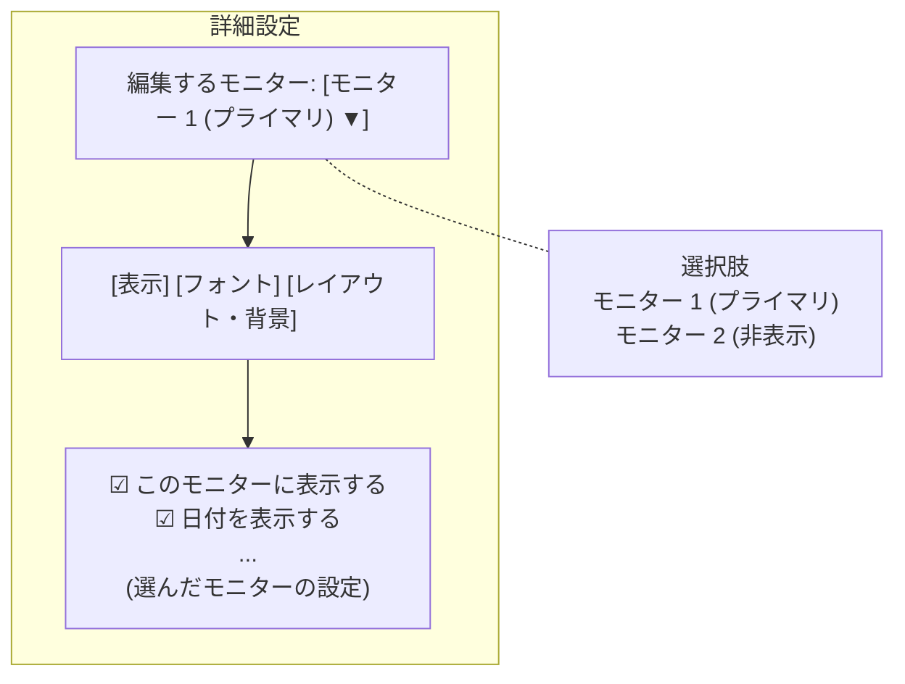
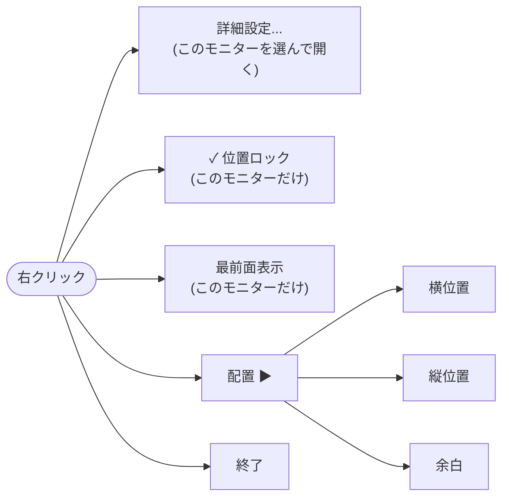
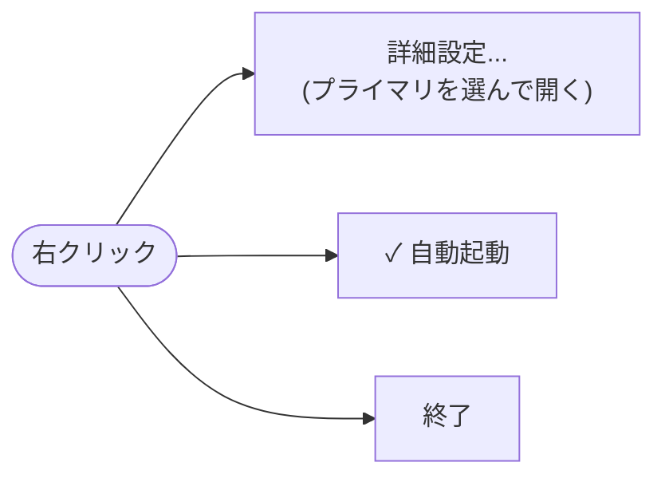

# モニタごとの設定の UI (issue #53・#17)

見た目・位置ロック・最前面表示をモニタごとに持つようにしたときの、詳細設定画面と右クリックメニューの形。

- 決めた経緯は spec.md の Clarifications (Session 2026-10-01) にある
- 検討した案 (変更前の形・見送った案) の図は、コミット `48a675a` のこのファイルにある

## 詳細設定画面 (FR-013・FR-014・FR-042)

- 画面の項目は、すべてドロップダウンで選んだモニタの設定
  - 表示/非表示は、「表示」タブの先頭の「このモニターに表示する」で切り替える
  - アプリ全体で共通の項目 (自動起動) は、この画面には置かない
- 画面を開いたときに選ばれているモニタ
  - ウィジェットの右クリックメニューから開いたときは、そのウィジェットのモニタ
  - タスクトレイから開いたときは、プライマリモニタ
  - 開いたまま別のモニタのウィジェットから開き直したら、そのモニタに切り替わる
- 開いている間にモニタをつないだり外したりすると、ドロップダウンの選択肢も変わる (issue #17)
  - 編集中のモニタを外したら、プライマリモニタの編集に切り替わる

## ウィジェット本体の右クリックメニュー (FR-012・FR-037)

- 項目は変更前と同じ。位置ロック・最前面表示が、そのウィジェットのモニタだけに効く

## タスクトレイの右クリックメニュー (FR-038)

- 位置ロック・最前面表示・配置は、ウィジェット本体の右クリックメニューで切り替える
- 左クリックで全ウィジェットを前に出す動き (FR-031) は変更前と同じ
